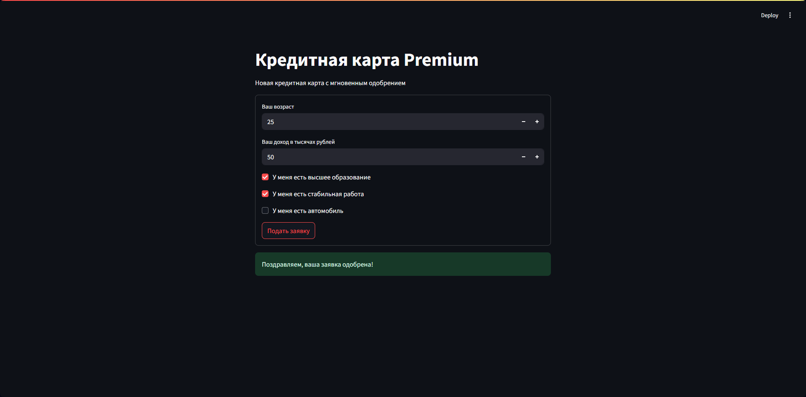

# Сервис кредитного скоринга



Запустите сервис скоринга с помощью команды:

Запустите сервис скоринга с помощью команды:

```shell
uvicorn service:app
```

Запросы к сервису скоринга можно выполнить со страницы [Swagger UI](http://localhost:8000/docs), с помощью [Postman](https://www.postman.com/downloads), `curl` или другого HTTP клиента.

Также запросы можно выполнить из Python с помощью библиотеки `requests`:

```python
import requests

data = {"age": 27, "income": 50, "education": True, "work": True, "car": False}
response = requests.post("http://127.0.0.1:8000/score", json=data)
print(response.json())
```

## Форма заявки

Перед началом убедитесь, что запустили сервис скоринга. Откройте новое окно терминала и выполните команду:

```shell
streamlit run app.py
```

Страница с приложением при этом откроется автоматически. Если вы случайно закрыли ее, к ней можно вернуться по ссылке в логах либо по [этому адресу](http://localhost:8501).
